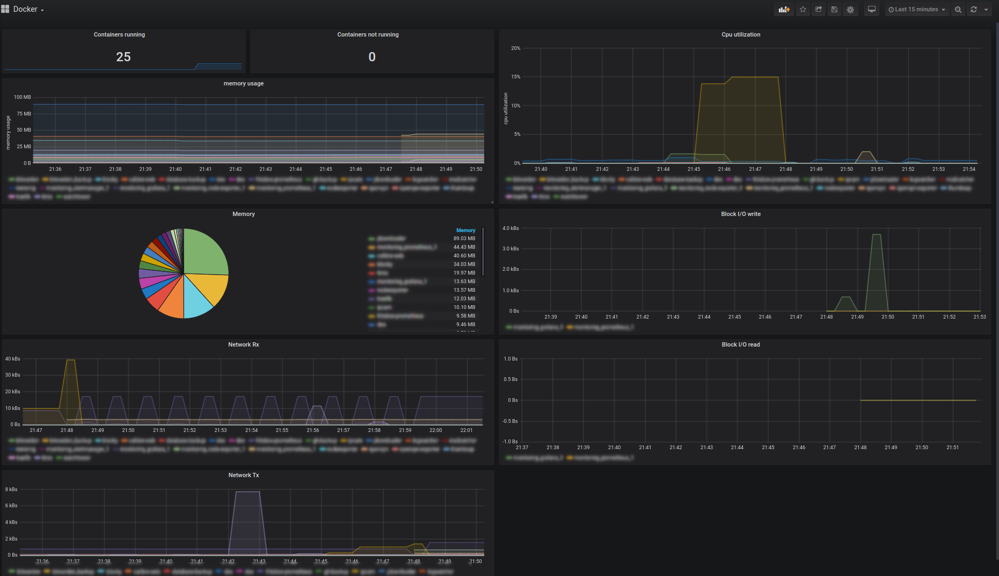
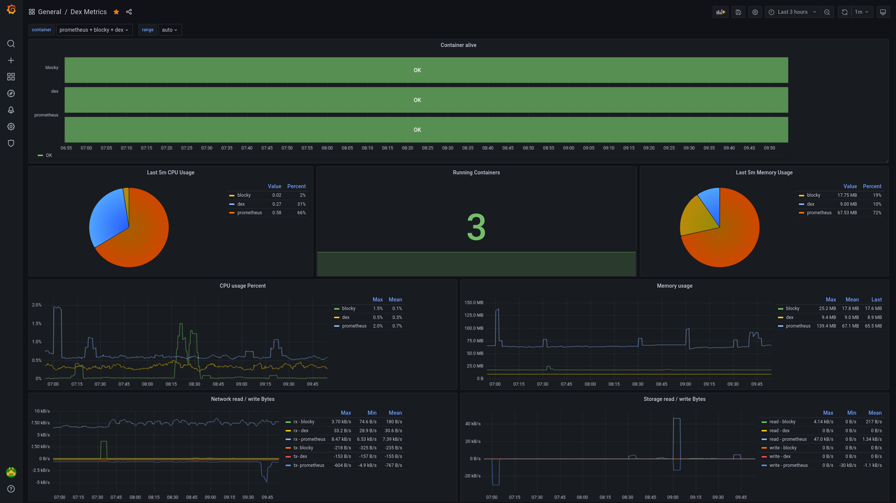

# DEX - Docker EXporter for prometheus

Simple lightweight prometheus exporter. Runs as docker container on all architectures.
Exports container state (running or not), current cpu and memory utilization, network and block I/O stats.

## Currently exposed metrics

- `dex_block_io_read_bytes_total`
- `dex_block_io_write_bytes_total`
- `dex_container_running`
- `dex_cpu_utilization_percent`
- `dex_cpu_utilization_seconds_total`
- `dex_memory_total_bytes`
- `dex_memory_usage_bytes`
- `dex_memory_utilization_percent`
- `dex_network_rx_bytes_total`
- `dex_network_tx_bytes_total`
- `dex_pids_current`

## Run with docker
Start docker container with following `docker-compose.yml`:
```yml
version: '2.1'
services:
   dex:
      image: spx01/dex
      container_name: dex
      volumes:
         - /var/run/docker.sock:/var/run/docker.sock
      ports:
         - 8386:8080
      restart: always
```

## Test with curl
```
$ curl localhost:8386/metrics
```

## Grafana dashboard

### Grafana 7

Example grafana7 dashboard definition [as JSON](grafana7.json)
.

### Grafana 8

Another dashboard for Grafana 8 (thanks @scMarkus !!!) [as JSON](grafana8.json)


Modification (thanks @GitSchorsch) with additional job filter [as JSON](grafana8_2.json)
